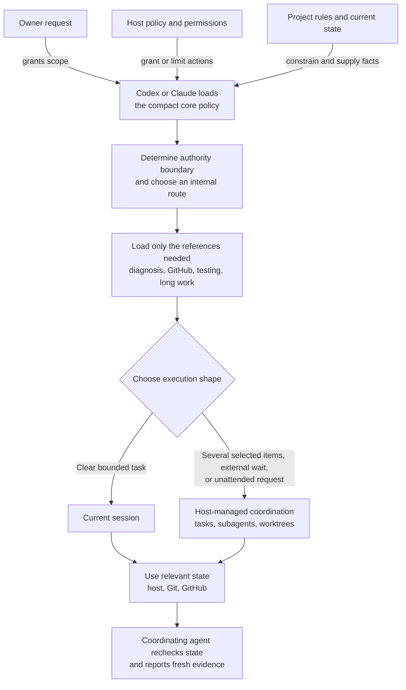

# SkipHow

SkipHow is one Agent Skill for product and project work in Codex and Claude Code. Describe the outcome. It chooses the smallest sufficient path and finishes only the work your request allows.

```text
The totals overlap on small screens. Find the cause and fix it.

Research our caching options. Record the decision, but do not change code.

Finish GitHub issues #41, #44, and #48 end to end. Merge accepted pull requests.
```

## Why I built it

I built SkipHow after trying [GSD](https://github.com/open-gsd/gsd-core), [OpenSpec](https://github.com/Fission-AI/OpenSpec), [Spec Kit](https://github.com/github/spec-kit), [Superpowers](https://github.com/obra/superpowers), [Matt Pocock's skills](https://github.com/mattpocock/skills), [BMAD](https://github.com/bmad-code-org/bmad-method), and [Paperclip](https://github.com/paperclipai/paperclip). Each got a different part right. SkipHow brings the practices I kept returning to into one skill, so I no longer have to choose a method before every task. The [prior-art record](docs/prior-art.md) covers more of the ideas and trade-offs behind the design.

## Install

### Codex

```sh
codex plugin marketplace add mzored/SkipHow
codex plugin add skiphow@skiphow
```

Start a new task and describe the work. If SkipHow does not activate, include `$skiphow`.

### Claude Code

```sh
claude plugin marketplace add https://github.com/mzored/SkipHow.git
claude plugin install skiphow@skiphow
```

Start a new session and describe the work. If SkipHow does not activate, use `/skiphow:skiphow`.

The [getting started guide](docs/getting-started.md) covers prerequisites, updates, uninstall, and troubleshooting.

## How it works

SkipHow is one instruction package, not a catalog of independent skills. Codex or Claude Code loads a compact core policy and follows this path. Only the owner request and host policy can authorize actions. Project rules and current state may narrow the work or add gates, but they cannot expand it.



The core policy contains the owner contract, authority boundary, routing rules, and completion rule. After routing, the host loads only the references the request needs. A clear bounded task can stay in the current session. Several selected items, an external wait, or an explicit unattended request can add host tasks, subagents, worktrees, and checkpoints.

This keeps unrelated instructions out of routine tasks. State stays in the systems that own it instead of a second task database. The coordinating agent re-reads those systems and checks the final state, so a worker's `done` message is never enough.

## What your request authorizes

| Example wording | What SkipHow does |
| --- | --- |
| `research`, `review`, `assess` | Reads and reports. It does not change the project. |
| `save`, `create Issues` | Creates the requested records. It does not implement them. |
| `fix`, `implement`, `deliver` | Changes the project and runs relevant checks. |
| `finish end to end`, `run unattended` | Allows guarded merge and cleanup for the selected work. |
| `pause`, `cancel`, `do not merge` | Stops or narrows the remaining work. |

Production changes, payments, credential changes, operations on private data, repository settings, public releases, and irreversible actions require a direct request from the owner. Host permissions and project rules still apply.

## Docs

- [User guide](docs/user-guide.md) for request patterns and tracked work
- [Trust](docs/trust.md) and [evaluation policy](docs/evals.md) for authority, safety, current evidence, and known limits
- [Documentation index](docs/README.md) for architecture, security, research, and contributor docs
